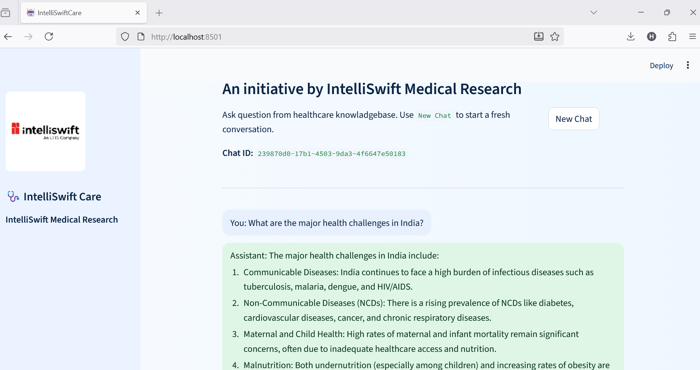

# 🩺 IntelliSwiftCare

### AI-Powered Healthcare Assistant

[](https://www.python.org/downloads/)
[](https://streamlit.io)
[](https://azure.microsoft.com/)
[](LICENSE)

**An initiative by IntelliSwift Medical Research**

IntelliSwiftCare is an intelligent healthcare chatbot leveraging **Azure Cognitive Search** and **Azure OpenAI** to provide accurate, source-backed medical information. Built with Streamlit for an intuitive user experience, it empowers clinicians, researchers, and healthcare professionals with instant access to a curated medical knowledge base.

---

## 📸 Application Preview

<p align="center">
  
</p>

<p align="center"><em>Interactive chat interface with real-time AI responses and source citations</em></p>

---

## ✨ Key Features

- **💬 Intelligent Healthcare Q&A** – Natural language queries with contextual understanding
- **📚 Retrieval-Augmented Generation (RAG)** – Combines vector search with LLM reasoning for accurate responses
- **🔗 Citation & Source Tracking** – Every answer includes verifiable sources with clickable Azure Blob links
- **🧪 Mock API Mode** – Test locally without Azure credentials using built-in Flask mock backend
- **☁️ Azure-Native Deployment** – Production-ready with App Service and Container Apps support
- **🧠 Stateful Sessions** – Maintains conversation context and chat history
- **⚡ Real-time Streaming** – Progressive response rendering for better UX

---

## 🏗️ Architecture

```
┌─────────────┐
│   User      │
└──────┬──────┘
       │
┌──────▼──────────────────┐
│  Streamlit Frontend     │
└──────┬──────────────────┘
       │
┌──────▼──────────────────┐
│  Azure Cognitive Search │ ◄── Document Retrieval
└──────┬──────────────────┘
       │
┌──────▼──────────────────┐
│  Azure OpenAI (GPT-4)   │ ◄── Answer Generation
└──────┬──────────────────┘
       │
┌──────▼──────────────────┐
│  Azure Blob Storage     │ ◄── Source Documents
└─────────────────────────┘
```

---

## 📁 Project Structure

```
IntelliSwiftCare/
│
├── .streamlit/              # Streamlit configuration
├── mock_backend/            # Development mock API
│   └── mock_api.py
├── static/                  # UI assets and styling
│   ├── helthcareai.png     # Application screenshot
│   └── style.css
├── utils/                   # Core application logic
│   ├── azure_api.py        # RAG pipeline & Azure integration
│   ├── blob_utils.py       # SAS URL generation
│   └── session_manager.py  # Session state management
│
├── app.py                   # Main Streamlit application
├── requirements.txt         # Python dependencies
├── startup.sh              # Azure App Service startup script
├── streamlit.sh            # Local development helper
├── .env.example            # Environment variables template
└── README.md               # This file
```

---

## 🚀 Quick Start

### Prerequisites

- Python 3.9 or higher
- Azure subscription (for production deployment)
- Git

### 1️⃣ Clone the Repository

```bash
git clone https://github.com/harshv2013/IntelliSwiftCare.git
cd IntelliSwiftCare
```

### 2️⃣ Set Up Virtual Environment

```bash
# Create virtual environment
python -m venv .venv

# Activate virtual environment
# On macOS/Linux:
source .venv/bin/activate

# On Windows:
.venv\Scripts\activate
```

### 3️⃣ Install Dependencies

```bash
pip install -r requirements.txt
```

### 4️⃣ Configure Environment Variables

```bash
# Copy example environment file
cp .env.example .env

# Edit .env with your Azure credentials
```

**Required Environment Variables:**

```env
# Azure Cognitive Search
AZURE_SEARCH_ENDPOINT=https://<your-search-service>.search.windows.net
AZURE_SEARCH_KEY=<your-search-key>
INDEX_NAME=medical-knowledge-index

# Azure Blob Storage
AZURE_STORAGE_ACCOUNT=<your-storage-account>
AZURE_STORAGE_KEY=<your-storage-key>

# Azure OpenAI
AZURE_OPENAI_ENDPOINT=https://<your-openai-service>.cognitiveservices.azure.com/
AZURE_OPENAI_KEY=<your-openai-key>
AZURE_OPENAI_DEPLOYMENT=gpt-4o-mini
```

### 5️⃣ Run the Application

```bash
streamlit run app.py
```

The application will be available at **http://localhost:8501**

---

## 🧪 Development Mode

### Using Mock Backend

For local testing without Azure services:

```bash
# Start mock API server
python mock_backend/mock_api.py
```

The mock API runs on `http://127.0.0.1:8000`

### Test Mock Endpoint

```bash
curl -X POST http://127.0.0.1:8000/query \
     -H "Content-Type: application/json" \
     -d '{"question": "What is diabetes?"}'
```

---

## ☁️ Deployment

### Deploy to Azure App Service

#### Option 1: Azure CLI

```bash
az webapp up \
  --runtime "PYTHON:3.11" \
  --sku B1 \
  --name intelliswiftcare \
  --resource-group rg-healthcare-ai
```

#### Option 2: Azure Portal

1. Create a new **Web App**
2. Select **Python 3.11** runtime
3. Configure **App Settings** (copy from `.env`)
4. Set startup command: `bash startup.sh`
5. Deploy from GitHub/Azure DevOps

### Deploy to Azure Container Apps

```bash
az containerapp up \
  --name intelliswiftcare \
  --resource-group rg-healthcare-ai \
  --environment containerapp-env \
  --image your-registry/intelliswiftcare:latest
```

---

## 💡 Usage Example

**User Query:**
> What are the major health challenges in India?

**AI Response:**
> India faces a complex healthcare landscape characterized by:
> 
> 1. **Communicable Diseases** – Tuberculosis, malaria, dengue, and COVID-19 remain significant concerns
> 2. **Non-Communicable Diseases** – Rising prevalence of diabetes, hypertension, cardiovascular diseases, and cancer
> 3. **Maternal & Child Health** – Malnutrition, infant mortality, and access to prenatal care
> 4. **Healthcare Infrastructure** – Urban-rural disparities in medical facility access
> 
> **Sources:**
> - [WHO India Health Report 2024](https://blob.azure.net/...)
> - [National Health Mission Guidelines](https://blob.azure.net/...)

---

## 🛠️ Tech Stack

| Category | Technology |
|----------|-----------|
| **Frontend** | Streamlit |
| **Backend** | Python, Flask (mock) |
| **AI/ML** | Azure OpenAI (GPT-4o-mini) |
| **Search** | Azure Cognitive Search |
| **Storage** | Azure Blob Storage |
| **Deployment** | Azure App Service / Container Apps |

---

## 📋 Requirements

```txt
streamlit>=1.28.0
openai>=1.0.0
azure-search-documents>=11.4.0
azure-storage-blob>=12.19.0
python-dotenv>=1.0.0
requests>=2.31.0
flask>=3.0.0
```

---

## 🤝 Contributing

Contributions are welcome! Please follow these steps:

1. Fork the repository
2. Create a feature branch (`git checkout -b feature/AmazingFeature`)
3. Commit your changes (`git commit -m 'Add some AmazingFeature'`)
4. Push to the branch (`git push origin feature/AmazingFeature`)
5. Open a Pull Request

---

## 📄 License

© 2025 IntelliSwift Medical Research. All rights reserved.

This project is developed for educational and research purposes. For commercial use, please contact the IntelliSwift team.

---

## 📧 Contact & Support

- **Project Lead:** [Harsh Vardhan](mailto:harsh2013@gmail.com)
- **Documentation:** [Wiki](https://github.com/harshv2013/IntelliSwiftCare/wiki)
- **Issues:** [GitHub Issues](https://github.com/harshv2013/IntelliSwiftCare/issues)

---

## 🙏 Acknowledgments

- Azure Cognitive Services team for AI infrastructure
- Open-source medical knowledge contributors
- Healthcare professionals who provided domain expertise

---

<p align="center">Made with ❤️ for better healthcare accessibility</p>